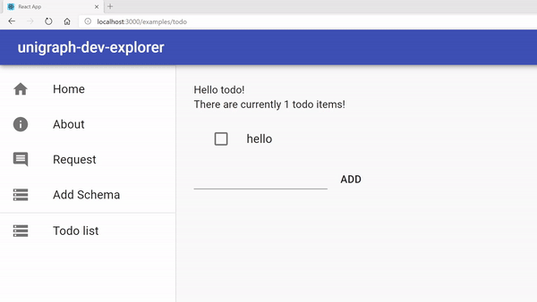

# unigraph-dev monorepo

A local-first and universal graph database, knowledge engine, and workspace for your life.

## Projects

This repository contains all relevant source code for unigraph-dev:

- packages/
    * backend/ : unigraph-dev local backend.

## Docs

For documentations, check out [Docs](./docs/README.md).

## Getting started

1. You'll need the custom dgraph binary from <https://github.com/haojixu/dgraph>.
2. Use the script `scripts/start_server.sh -d "<data directorty>" -b "<dgraph binary location>"` to start the dgraph and unigraph servers.
3. Use `yarn explorer-start` to start the frontend.

## Demos
